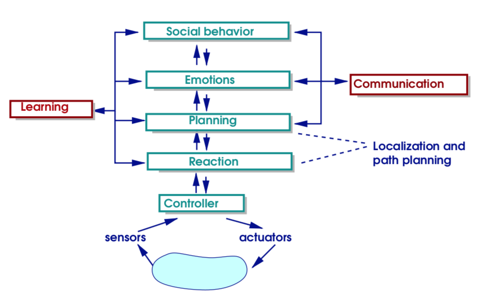

# CS4260: Artificial Intelligence - (Universidad Carlos Tercero Madrid)

### Final Exam
- NLP
    - complexity in ambiguity
        1. phonology (flew, flu)
        2. lexical: noun / verb
        3. syntactic:
            - I'm flying to Madrid
            - Time flies
        4. semantics: hard = !easy and !soft
        5. discourse (referential)
            - I took the cake from the table and cleaned it
            - I took the cake from the table and ate it
        6. pragmatics: may I go?

