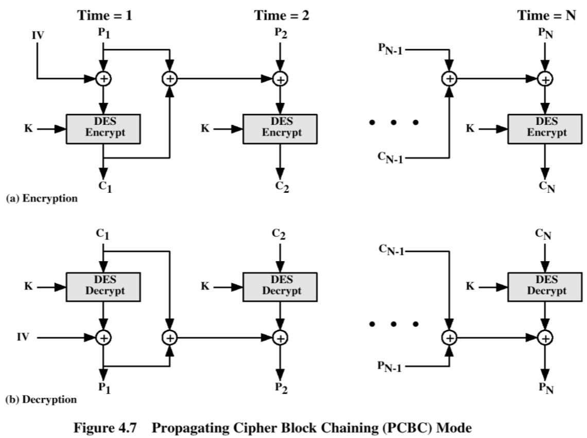

## Final Exam

### Unit 1
- information sec CIA triangle
    1. confidentiality
        - more confidentiality, more control
        - more confidentiality, less access        
    2. integrity
        - data degradation types:
            1. invalid 
            2. redundant
            3. inconsistent
            4. anomalous
            5. read inconsistency
            6. nonconcurrency
    3. availability
- risk: threat, vulnerability, impact
- lifecycle:
    1. design
    2. implement
    3. check
    4. maintain
- default security: full mediation
- design principles
    1. simplicity > complexity
    2. default = block
    3. all access must be filtered
    4. transparent sec against dark sec
    5. segregation of duties
    6. minimum priviledge
    7. minimum common mechanisms
    8. user acceptability
    9. working factor
    10. event log

### Unit 2: Malware
- types
    - worm
        - autonomous
        - replicates & spreads
    - virus
        - programs contained in others
        - phases:
            1. propagation
            2. latency
            3. activation
            4. damage
        - types:
            1. metamorphic: change every iteration
            2. polymorphic: change only parts to prevent detection
    - trojan horse
    - logic bomb
        - unexpected effect
    - backdoor
        - undocumented / secret
- taxonomy
    - only worms are autonomous
    - only worms and viruses are self reproducing
- APT: advanced persistent threat
    - malware designed to stay undetected
    - detection:
        - large # of reqs from same IP
        - transmission of large amounts of data
        - 3rd party warnings
    - ex:
        - stuxnet

### Unit 3: Access Control Systems
- representation
    - ACL / matrix
        - regular: object -> users
        - habilitation: user -> objects
        - auth relations: tuples of (S, O, rights)
- DAC
    - same but with owners
- multilevel security:
    - BLP (bell lapadula)
        - data confidentiality
        - rules
            1. read all under
            2. if can read 1 and write 2, l(1) <= l(2) (* property)
                - cannot write on lower
            3. no change in levels
    - BIBA
        - data integrity
        - rules
            1. cannot read from a lower level
            2. if can read 1 and write 2, l(1) >= l(2) (* property)
                - cnanot write on higher
            3. no change
    - Clark Wilson
        - integrity
    - problems:
        - expensive
        - complex administration & conversion of current system
        - prevents unauth'd but also auth'd
- multilateral:
    - chinese wall
        - grants if:
            1. p in set of company already with access
            2. p does not belong to conflict of interest
        - s can write o if never read o' (CoI) (* property)
- multilevel & multilateral
    - classification level
        - o: (compartment, confidentiality)
        - s: (compartment, habilitation)
    - o_i <= s_i

### Unit 4: Distributed Systems Protocol
- threats
    - passive
        - interception
        - war driving
        - port scan
    - active
        - interruption
            - ddos
            - icmp flood
            - tcp-syn
        - modification
            - ip spoof
            - pharming
            - dns identity theft
        - generation
            - session hijacking

### Unit 4: SSL/TLS
- SSL protocols
    1. handshake
    2. change cipher spec
    3. alert / warning
    4. record
- security services
    1. confidentiality
        - crypto
    2. integrity
        - mac
    3. auth
        - one way funcs
        - question answer
        - e-sign
    4. access control
    5. non-repudiation

### Unit 4: Kerberos
- centralized auth server
- symmetric encryption (DES)
- uses propogating cipher block chain

### Unit 4: IPSec
- security issues in IP
    - networks are not secure since all users were originally known
- IPSec: standard for network layer security
    - auth protocol (AH auth header)
    - encryp / auth protocol (ESP encapsulated security protocol)
- mandatory for IPv6
